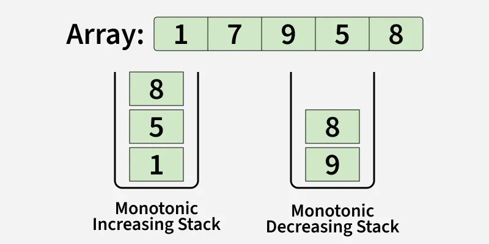

# 496. Next Greater Element I

The next greater element of some element x in an array is the first greater element that is to the right of x in the same array.

You are given two distinct 0-indexed integer arrays nums1 and nums2, where nums1 is a subset of nums2.

For each 0 <= i < nums1.length, find the index j such that nums1[i] == nums2[j] and determine the next greater element of nums2[j] in nums2. If there is no next greater element, then the answer for this query is -1.

Return an array ans of length nums1.length such that ans[i] is the next greater element as described above.

        Example 1:

        Input: nums1 = [4,1,2], nums2 = [1,3,4,2]
        Output: [-1,3,-1]
        Explanation: The next greater element for each value of nums1 is as follows:
        - 4 is underlined in nums2 = [1,3,4,2]. There is no next greater element, so the answer is -1.
        - 1 is underlined in nums2 = [1,3,4,2]. The next greater element is 3.
        - 2 is underlined in nums2 = [1,3,4,2]. There is no next greater element, so the answer is -1.

## Constraints:

1 <= nums1.length <= nums2.length <= 1000
0 <= nums1[i], nums2[i] <= 104
All integers in nums1 and nums2 are unique.
All the integers of nums1 also appear in nums2.
 

#### Follow up: Could you find an O(nums1.length + nums2.length) solution?

## Approach

Anyone can do O(n*m) TC code but few one can do follow up

- For *O(n+m)* you must know what is monotonic stack (See Below)
- Now store nums2 element in stack in increasing order and store everynumber greater element in map Ex: [1,4,3] we store mp[1] = 4 similarly for others
- Then after storing all numbers in map just traverse the nums1 and fill their values from map

# Monotonic Stack

A monotonic stack is a stack data structure that maintains its elements in a strictly increasing or decreasing order (bottom to top), achieved by popping elements that violate the order before pushing a new one, making it highly efficient (O(n)) for finding "next greater/smaller element" or "previous greater/smaller element" in arrays, solving problems like Largest Rectangle in Histogram or Daily Temperatures. 

#### Types & Use Cases

- Monotonic Increasing Stack: Elements increase from bottom to top (e.g., [1, 3, 5]). Used for finding Next/Previous Smaller Elements.

- Monotonic Decreasing Stack: Elements decrease from bottom to top (e.g., [5, 3, 1]). Used for finding Next/Previous Greater Elements. 

#### Key Benefits

- **Linear Time (O(n))**: Each element is pushed and popped at most once.

- Efficient Queries: Solves problems requiring proximity (next/previous) in a single pass. 