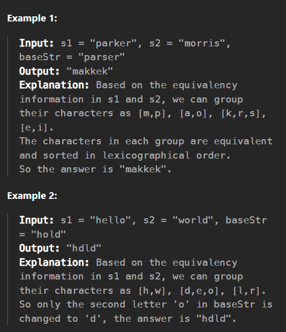

# 1061. Lexicographically Smallest Equivalent String

You are given two strings of the same length s1 and s2 and a string baseStr.

We say s1[i] and s2[i] are equivalent characters.

For example, if s1 = "abc" and s2 = "cde", then we have 'a' == 'c', 'b' == 'd', and 'c' == 'e'.
Equivalent characters follow the usual rules of any equivalence relation:

Reflexivity: 'a' == 'a'.

Symmetry: 'a' == 'b' implies 'b' == 'a'.

Transitivity: 'a' == 'b' and 'b' == 'c' implies 'a' == 'c'.

For example, given the equivalency information from s1 = "abc" and s2 = "cde", "acd" and "aab" are equivalent strings of baseStr = "eed", and "aab" is the lexicographically smallest equivalent string of baseStr.

Return the lexicographically smallest equivalent string of baseStr by using the equivalency information from s1 and s2.

----------------------------------------------------------------

----------------------------------------------------------------

# Approach

Key Steps:

1. Union-Find Data Structure (Disjoint Set Union - DSU):

    - This data structure helps efficiently manage and merge equivalence classes (groups of equivalent characters).

    - Each character will be part of a group, and the group will be represented by its lexicographically smallest character.

2. Processing Equivalence Pairs:

    - Iterate through each pair of characters from s1 and s2.

    - For each pair (s1[i], s2[i]), unite their groups in the DSU structure, ensuring the smallest character becomes the parent (representative) of the group.

3. Constructing the Result:

    - For each character in baseStr, find its smallest equivalent character (parent in the DSU structure).

    - Construct the result string by replacing each character in baseStr with its smallest equivalent.

-------------------------------------------------------------------

## Example Walkthrough:

- Input: s1 = "abc", s2 = "cde", baseStr = "eed"

- Equivalence Groups:

    - 'a' == 'c' → group represented by 'a'

    - 'b' == 'd' → group represented by 'b'

    - 'c' == 'e' → since 'c' is in the 'a' group, 'e' joins the 'a' group

- Final Groups:

    - 'a', 'c', 'e' → represented by 'a'

    - 'b', 'd' → represented by 'b'

- Result for "eed":

    - 'e' → 'a'

    - 'e' → 'a'

    - 'd' → 'b'

- Output: "aab"

---------------------------------------------------------------

## Time and Space Complexity:

- **Time Complexity**: O(n α(n)), where n is the length of s1 (or s2), and α is the inverse Ackermann function (effectively constant).

- **Space Complexity**: O(1) or O(26) since we only deal with lowercase English letters.

### This approach efficiently handles the equivalence relationships and constructs the lexicographically smallest string by leveraging the union-find data structure.

Question link: https://leetcode.com/problems/lexicographically-smallest-equivalent-string/