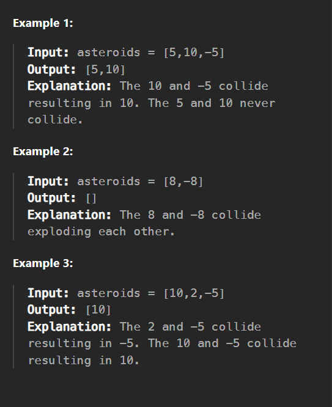

# 735.   ASTEROID COLLISION

We are given an array asteroids of integers representing asteroids in a row. The indices of the asteriod in the array represent their relative position in space.

For each asteroid, the absolute value represents its size, and the sign represents its direction (positive meaning right, negative meaning left). Each asteroid moves at the same speed.

Find out the state of the asteroids after all collisions. If two asteroids meet, the smaller one will explode. If both are the same size, both will explode. Two asteroids moving in the same direction will never meet.

---------------------------------------------

---------------------------------------------

## Constraints:

2 <= asteroids.length <= 104

-1000 <= asteroids[i] <= 1000

asteroids[i] != 0

---------------------------------------------

## Collision Rules:

1. Same Direction: No collision (both continue moving).

2. Opposite Directions:

 - Left-moving asteroid (negative) collides with right-moving asteroid (positive) if the left-moving one is to the right of the right-moving one.

 - The smaller asteroid explodes.

 - If same size, both explode.

3. No Collision:

 - Right-moving asteroid (positive) on the left of a left-moving asteroid (negative) will never collide (they move away from each other).

---------------------------------------------

# Approach

We can simulate the collisions using a stack:

1. Iterate through each asteroid.

2. For each asteroid:

    - If moving right (> 0): Push to stack (no collision yet).

    - If moving left (< 0):

        - Check if it collides with the top of the stack (which must be moving right).

        - Resolve collisions until no more collisions are possible.

3. Final stack represents the remaining asteroids after all collisions.

---------------------------------------------

# Example Walkthrough

Input: asteroids = [5, 10, -5]

Execution:

1. 5 (right) → stack = [5]

2. 10 (right) → stack = [5, 10]

3. -5 (left):

  - Collides with 10 (right):

    - 10 > 5 → -5 explodes.

  - Final stack: [5, 10]

  Output: [5, 10]

Input: asteroids = [8, -8]

Execution:

1. 8 (right) → stack = [8]

2. -8 (left):

   - Collides with 8 (right):

    - Same size → both explode (stack.pop()).

   - Final stack: []

Output: []

---------------------------------------------

# Time & Space Complexity

Time Complexity: O(n) (each asteroid is pushed and popped at most once).

Space Complexity: O(n) (stack storage in the worst case).

---------------------------------------------

## Python Solution 

        def asteroidCollision(asteroids):
            stack = []
            for asteroid in asteroids:
                # Handle collisions only when current asteroid is moving left and top of stack is moving right
                while stack and asteroid < 0 < stack[-1]:
                    if stack[-1] < -asteroid:  # Top asteroid explodes
                        stack.pop()
                        continue
                    elif stack[-1] == -asteroid:  # Both explode
                        stack.pop()
                    break  # Current asteroid explodes or no more collisions
                else:
                    stack.append(asteroid)  # No collision, add to stack
            return stack

----------------------------------------------

Question Link: https://leetcode.com/problems/asteroid-collision/  # noqa: E501
