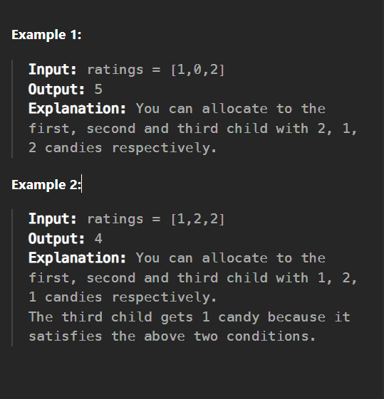

# 135. Candy

There are n children standing in a line. Each child is assigned a rating value given in the integer array ratings.

You are giving candies to these children subjected to the following requirements:

Each child must have at least one candy.

Children with a higher rating get more candies than their neighbors.

Return the minimum number of candies you need to have to distribute the candies to the children.

## Constraints:

n == ratings.length

1 <= n <= 2 * 104

0 <= ratings[i] <= 2 * 104

# Approach📌

1. Initialization: We start by giving each child 1 candy.

2. Left to Right Pass:

-> For each child from left to right, if their rating is higher than their left neighbor, their candy count is set to one more than the left neighbor's.

3. Right to Left Pass:

-> For each child from right to left, if their rating is higher than their right neighbor, their candy count is set to the maximum of its current value or one more than the right neighbor's. This ensures we don't reduce any candy counts from the left pass.

4. Summing Candies: Finally, we sum up all the candies to get the minimum total required.

## Time Complexity : O(N) where N is the number of children.

--------------------------------------------------------------------------------------------------------

Question Link: https://leetcode.com/problems/candy/description/?envType=daily-question&envId=2025-06-02

Solution Link: https://leetcode.com/problems/candy/solutions/6803869/greedy-double-pass-beats-100-users

