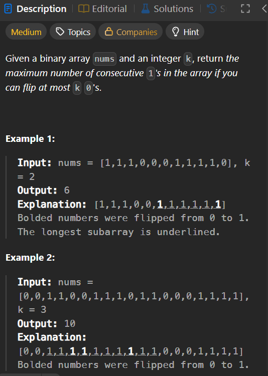

1004. Max Consecutive Ones III                                  {question link provided at end}

# Approach

To search for a value in a Binary Search Tree (BST), we can leverage the BST property where:

All nodes in the left subtree of a node have values less than the node's value.

All nodes in the right subtree of a node have values greater than the node's value.

Steps:

1. Base Case: If the root is nullptr (or None in Python), return nullptr/None (value not found).

2. Check Current Node: If the current node's value matches the target value, return the node.

3. Recursive Search:

### If the target value is less than the current node's value, search the left subtree.

### If the target value is greater than the current node's value, search the right subtree.

# Time Complexity

Average Case (Balanced BST): O(log n)

Worst Case (Unbalanced BST, e.g., a linked list): O(n)

If the tree is skewed, we might have to traverse all n nodes.

# Space Complexity

Average Case (Balanced BST): O(log n)

Worst Case (Unbalanced BST): O(n)

If the tree is a straight line (completely unbalanced), the recursion stack can grow up to n levels deep.

Question Link: https://leetcode.com/problems/max-consecutive-ones-iii/

Leetcode Profile: https://leetcode.com/udayyyy09/