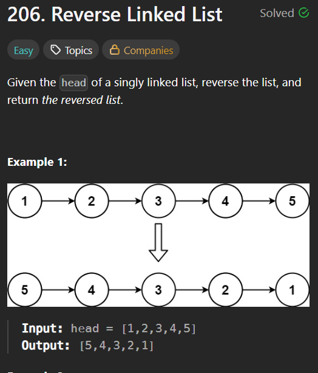

# 206. Reverse a Linked List

### Constraints:

The number of nodes in the list is the range [0, 5000].
-5000 <= Node.val <= 5000

# Approach📌

There are two primary ways to reverse a linked list:

Iterative Approach (Preferred for most cases)

Recursive Approach (Useful for understanding recursion)

------------------------------------------------------------------------------------------

## 1. Iterative Approach

Algorithm Steps

- Initialize three pointers:
  
   - prev = nullptr
  (Previous node)
     
   - curr = head (Current node)

   - next = nullptr (Next node)

- Traverse the list:

    - Store next = curr->next.

    - Reverse the link: curr->next = prev.

    - Move pointers forward: prev = curr, curr = next.

- Update the new head to prev (last node of the original list).

### Time Complexity

Time: O(n) (Single pass through the list)

Space: O(1) (In-place reversal)

------------------------------------------------------------------------------------------

## 2. Recursive Approach

Algorithm Steps

1. Base Case: If head is nullptr or head->next is nullptr, return head.

2. Recursively reverse the rest of the list (head->next).

3. Fix the links:

    1. head->next->next = head (Reverse the link).

    2.  head->next = nullptr (Break the old link).

4. Return the new head (from the base case).

------------------------------------------------------------------------------------------

## Time Complexity

Time: O(n) (Each node processed once)

Space: O(n) (Recursion stack)
