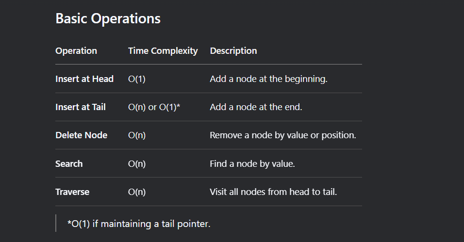

# Linked List

Overview

A Linked List is a linear data structure where elements (nodes) are linked using pointers. Unlike arrays, linked lists do not require contiguous memory allocation, allowing dynamic size adjustments.

--------------------------------------------------

# Types of Linked Lists

Singly Linked List

Each node points to the next node.

Last node points to nullptr/NULL.

Operations: Insert/Delete at head, tail, or middle.

Doubly Linked List

Each node has pointers to both the next and previous nodes.

Allows traversal in both directions.

Operations: More efficient deletions/insertions at arbitrary positions.

Circular Linked List

The last node points back to the head (singly or doubly linked).

Useful for round-robin scheduling.

-------------------------------------------------------

----------------------------------------------------------

Implementation (C++)

1.  Node Structure

        struct Node {
            int data;
            Node* next; // For singly linked list
            Node* prev; // For doubly linked list
        };

2.  Singly Linked List Example

            class LinkedList {
        private:
            Node* head;
        public:
            LinkedList() : head(nullptr) {}

            // Insert at head
            void insertAtHead(int val) {
                Node* newNode = new Node{val, head};
                head = newNode;
            }

            // Print the list
            void print() {
                Node* curr = head;
                while (curr) {
                    cout << curr->data << " -> ";
                    curr = curr->next;
                }
                cout << "nullptr" << endl;
            }
        };

----------------------------------------------------------

## Common Problems

1. [Reverse a Linked List](https://leetcode.com/problems/reverse-linked-list/description/?envType=study-plan-v2&envId=leetcode-75)

- Iterative: Use three pointers (prev, curr, next).

- Recursive: Reverse the rest of the list and link the head.

2. [Detect Cycle](https://www.geeksforgeeks.org/detect-cycle-in-a-graph/)

- Floyd’s Algorithm (Tortoise and Hare).

3. [Merge Two Sorted Lists](https://leetcode.com/problems/merge-two-sorted-lists/description/?envType=problem-list-v2&envId=linked-list)

- Compare nodes and merge in O(n + m) time.

4. [Remove Nth Node from End](https://leetcode.com/problems/remove-nth-node-from-end-of-list/description/?envType=problem-list-v2&envId=linked-list)

- Two-pass: Count nodes, then delete.

- One-pass: Fast and slow pointers.

----------------------------------------------------------

## Applications

- Stacks/Queues: Implemented using linked lists.

- Hash Tables: Handle collisions via chaining.

- Memory Management: OS memory allocation.

- Undo Functionality: Doubly linked lists in editors.

----------------------------------------------------------

## Further Reading

- GeeksforGeeks - Linked List

- LeetCode Linked List Problems
